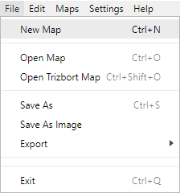
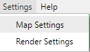

# Change Log

All notable changes to "Yggdrasil" will be documented in this file.

## [0.5.0] - 2020-07-13

#### Added
* All existing Exporters
  * "Up/Down" connector direction.
  * "In/Out" connector direction.
* TADS exporter
  * Dark room support.
* Quest exporter
  * Dark room support.
* Alan 3 exporter
  * Dark room support.
* ZIL Exporter
  * Initial support.
* YAML Exporter
  * Initial support.

## [0.4.0] - 2020-07-12

#### Added
* Upstream changes by Trizbort.io
  * Keyboard help
  * Help Toasts
  * TextAdventure.js exporter
  * Holding the right mouse button and moving the mouse now pans the map.
  * Copied and pasted objects now appear at the mouse position rather than the center of the window.

## [0.3.0] - 2020-01-12

#### Added
* The application is now fully translatable/localizable.
  * Transifex Project: https://www.transifex.com/happy-ferret/yggdrasil/dashboard/

### *Desktop App*

#### Added
* First official [builds](https://github.com/middangeard-fiction/yggdrasil/releases) available (Windows only).

## [0.2.0] - 2019-08-17

#### Added
* Middangeard 1 Exporter
  * Author, Title, Description/Intro, 
    Rooms, Directions and Items only.
  * No item attributes/synonyms/articles/containers (yet).

#### Changed
* Revised exported direction scheme
  * Changed in-between directions to closest cardinal directions,
    mirroring [Trizbort 1.5.8+](http://www.trizbort.com/Docs/index.shtml#help_conn_ports).
* Map Settings
  * Added ``Map version`` field.

#### Fixed
  * [Map export yields blank image when there is no room present in the center of the map.](https://github.com/henck/trizbort/issues/1)
  * [Trizbort importer inoperable beyond first (successful) import.](https://github.com/henck/trizbort/issues/27)
  * Polluted dialog state
    * When cancelling a dialog, the state of it would previously be retained.
        Upon confirming the next dialog, the action of the previous dialog
      would also be called. 
        * I. e. cancelling a "New Map dialog" and applying a map theme would
        simultaneously reset the map.

### *Desktop App*

#### Added
* Prior to exiting the application, the user is now prompted that all unsaved data will be lost.
* New menu bar options.

## [0.1.0] - 2019-08-09

#### Added
* Initial desktop client.
  * Electron ([Go-Astilectron](https://github.com/asticode/go-astilectron)) based.
  * Windows, Mac OS and GNU/Linux support.
  * Quickly choose from a set of predefined sample maps.

  

## [0.0.2] - 2019-08-08

#### Improvement
* Inverted keyboard navigation (arrow keys, Page Up/Down, Home/End).
* Movement events are now fired during keydown, for continuous, swift navigation.

## [0.0.1] - 2019-08-07

#### Initial release
* Trizbort.io derivative with the following changes:
  * Branding
    * The application name is now "Yggdrasil" instead of "Trizbort".
    * The header is a shade of green <small><small>(#5cc070)</small></small> rather than blue <small><small>(#5c6bc0)</small></small>.
  * **TADS** export fix
    * Previously, the map title was not exported properly.