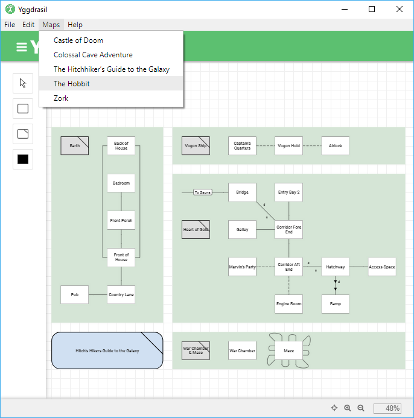

# Change Log

All notable changes to "Yggdrasil" will be documented in this file.

## [0.1.0] - 2019-08-09

#### Added
* Initial desktop client.
  * Electron ([Go-Astilectron](https://github.com/asticode/go-astilectron)) based.
  * Windows, Mac OS and GNU/Linux support.
  * Quickly choose from a set of predefined sample maps.

  

## [0.0.2] - 2019-08-08

#### Improvement
* Inverted keyboard navigation (arrow keys, Page Up/Down, Home/End).
* Movement events are now fired during keydown, for continuous, swift navigation.

## [0.0.1] - 2019-08-07

#### Initial release
* Trizbort.io derivative with the following changes:
  * Branding
    * The application name is now "Yggdrasil" instead of "Trizbort".
    * The header is a shade of green <small><small>(#5cc070)</small></small> rather than blue <small><small>(#5c6bc0)</small></small>.
  * **TADS** export fix
    * Previously, the map title was not exported properly.